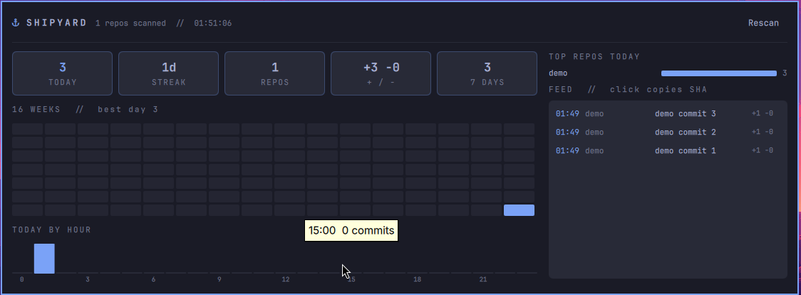

# Shipyard

An Omarchy bar widget that shows what you **shipped** today.


Shipyard counts your commits across every local git repo (`~/Projects/*`,
`~/Projects/*/*`, `~/.claude`, `~/.config/omarchy`) and puts today's count and
your day streak on the bar. Click it for the cockpit:



*(Screenshot from a Test Drive VM with a demo repo.)*

- **Today / Streak / Repos / +- lines / 7 days** tiles
- **16-week heatmap** (hover a cell for the date and count)
- **Today by hour** histogram
- **Top repos today**
- **Feed** of today's commits (scrolls in place; click a row to copy the SHA)

Read-only, local, no network, no tokens. Counts commits authored by your
`git config --global user.email` plus `noreply@anthropic.com` co-authored work,
across all branches, merges excluded. `_archive/` and `node_modules` are skipped.

## How it works

`shipyard.py` walks the repos, runs `git log --shortstat`, and prints one JSON
object. Each repo is cached in `~/.cache/shipyard/cache.json`, keyed on the
mtimes of its `.git` refs, so a warm scan of ~200 repos takes under 100 ms. Only
the first scan of the day walks every log (~20 s on gus).

## Install

```bash
cp -r . ~/.config/omarchy/plugins/nixfred.shipyard
omarchy-shell shell rescanPlugins
omarchy plugin enable nixfred.shipyard right
```

Settings: `refreshSec` (default 60) and `showStreak`.

MIT, by nixfred.
